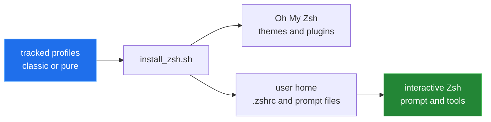
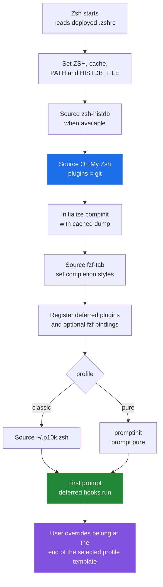
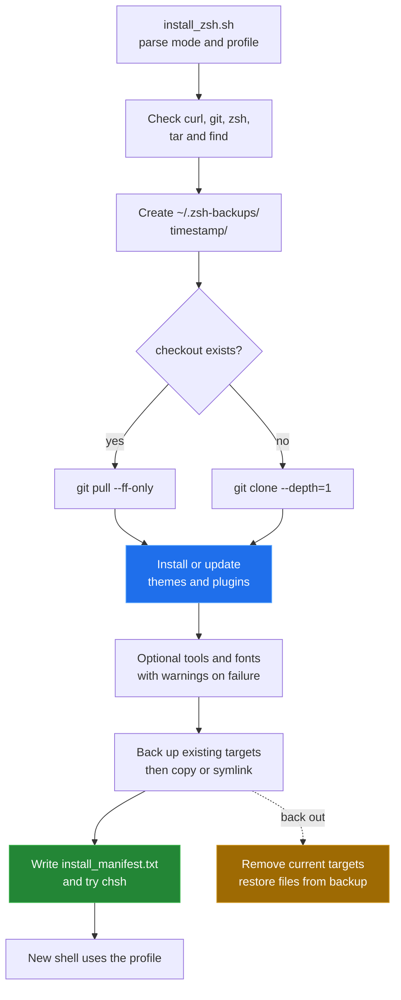

# Zsh Config Installer

This repository installs a reproducible Zsh environment built around Oh My Zsh,
with Powerlevel10k Classic or Pure as the prompt, a shared completion and
history stack, and copy or symlink deployment. The installer updates external
checkouts, backs up files it replaces, and records the selected profile and
deployment mode in an install manifest.



## Quick start

```sh
git clone https://github.com/Bissbert/zsh.dotfiles.git ~/dotfiles/zsh.dotfiles
cd ~/dotfiles/zsh.dotfiles

# Inspect the supported deployment options.
bash install_zsh.sh --help

# Deploy the classic profile as symlinks.
bash install_zsh.sh --link
```

Both commands above were run to completion in a Debian 12 container, as was a
second run over the same home (the update path). The run is described in
[`docs/measurement.md`](docs/measurement.md).

Use `--copy` instead of `--link` for independent deployed files, or select the
Pure prompt with `--profile pure`. The Pure install deploys its files but exits
1 before changing the login shell and writing the manifest
([bug 2](docs/BUGS-FOUND.md#2-the-pure-install-exits-1-before-the-default-shell-and-manifest-steps)):

```sh
bash install_zsh.sh --copy
bash install_zsh.sh --profile pure --link
```

## How a profile loads

The selected profile is deployed as `~/.zshrc` (or under `ZDOTDIR`). The profile
sets paths and history locations, sources the core, initializes completion,
loads `fzf-tab`, registers deferred plugins, and then reaches the prompt. The
classic profile also sources `~/.p10k.zsh`; Pure loads its prompt from the
custom theme directory instead.



There is no separate override file in this repository. Put persistent shell
overrides at the end of `profiles/classic/zshrc` or `profiles/pure/zshrc`; put
Powerlevel10k segment changes in `profiles/classic/p10k.zsh`. With `--link`,
the deployed file points back to the repository, so editing the target edits
the checkout too.

## Installer and update flow



Existing `.zshrc` and `.p10k.zsh` files are copied into the timestamped backup
directory before deployment. The classic profile also backs up an existing
Fastfetch logo. Updating an existing checkout is a fast-forward-only pull.
Pure does not provide a Powerlevel10k template; if a `.p10k.zsh` already exists,
the installer leaves it in place.

## Profiles and capabilities

| Capability | Classic | Pure |
|---|---|---|
| Prompt | Powerlevel10k Classic | Pure async prompt |
| Prompt config | `~/.p10k.zsh` from the profile | no new `.p10k.zsh` |
| Fastfetch banner | terminal-only, when available | not configured |
| Oh My Zsh core and `git` plugin | yes | yes |
| `zsh-completions`, `compinit`, `fzf-tab` | yes | yes |
| SQLite-backed `zsh-histdb` | yes, when its script is present | yes, when its script is present |
| Deferred suggestions and syntax highlighting | yes | yes |
| Optional `autojump`, `direnv`, and fzf bindings | detected at startup | detected at startup |

The profile-specific details and source order are in
[`docs/profiles.md`](docs/profiles.md). The module-to-capability table is in
[`docs/customization.md`](docs/customization.md).

## Startup cost

The following values are the fastest of nine samples after a warm-up round, in
a Debian 12 container (Docker Desktop VM, aarch64) with Zsh 5.9. `first prompt`
uses a real PTY and includes deferred hooks; `zsh -i -c exit` does not reach a
prompt.

| Configuration | First prompt | `zsh -i -c exit` |
|---|---:|---:|
| Bare Zsh, no `.zshrc` | 3 ms | 4 ms |
| Classic profile | 106 ms | 65 ms |
| Pure profile | 451 ms | 65 ms |

The complete interactive-shell inventory for Classic differed from bare Zsh by
233 aliases, 2,118 functions, 106 widgets, 33 key-binding lines, and 1,966
completion definitions in the same sandbox. Those are shell-surface diffs, not
claims that each name belongs uniquely to one plugin.

See [`docs/measurement.md`](docs/measurement.md) for commands, sampling rules,
sandbox details, and the raw JSON produced by the tools.

## Repository layout

```text
README.md                 illustrated overview and startup results
install_zsh.sh            copy/link installer and updater
profiles/classic/         Powerlevel10k profile and Fastfetch assets
profiles/pure/            Pure prompt profile and notes
docs/                     subsystem write-ups and measurement method
tools/                    measurement scripts, results and the Linux run
```

## Known limitations

- The Pure install exits 1 after deploying its files, so it does not change
  the login shell or write `install_manifest.txt`
  ([bug 2](docs/BUGS-FOUND.md#2-the-pure-install-exits-1-before-the-default-shell-and-manifest-steps)).
- Only the Linux path has been run, as root in a container. The macOS font
  path and a `sudo`-based install have not been run.
- Installation and updates need network access. Optional package installation
  is apt-based, and changing the login shell depends on `chsh` permissions.
- `--link` requires the repository to remain at the same path. `--copy` avoids
  that coupling but must be rerun after profile changes.
- The profiles defer plugin sources until the first prompt. The noninteractive
  `zsh -i -c exit` number therefore understates the interactive first-prompt
  cost.
- The startup results use shallow external checkouts in a temporary sandbox;
  plugin revisions and machine load can change the timings. The Pure
  first-prompt time does not break down into per-block costs; see
  [`docs/measurement.md`](docs/measurement.md#startup-benchmark).
- No terminal animation is shipped. The diagrams are Mermaid source diagrams;
  the installer output is in
  [`docs/captures/linux-run.txt`](docs/captures/linux-run.txt).

More detail is indexed in [`docs/README.md`](docs/README.md).
