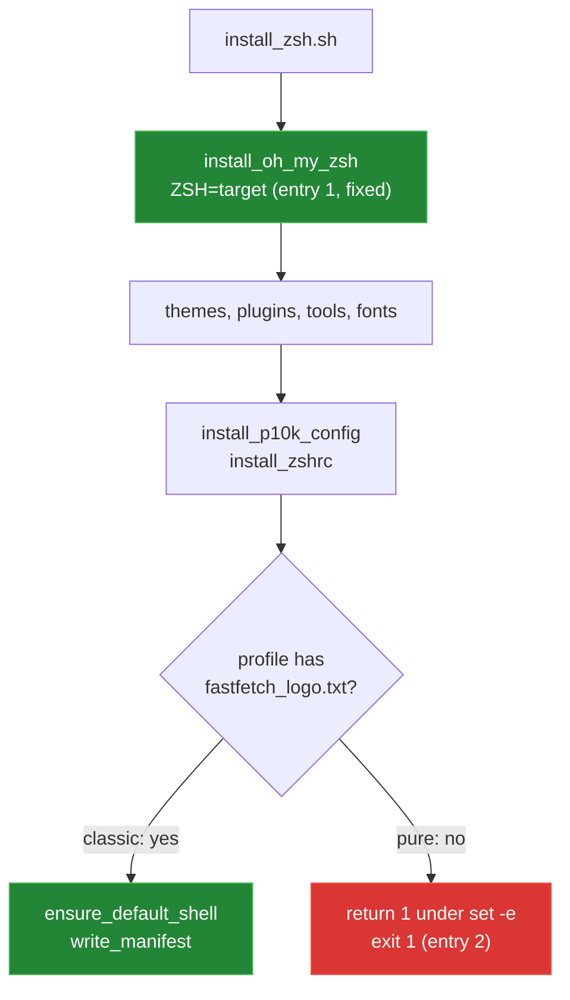

[← back to the overview](../README.md)

# Bugs found

One bug was reproduced, reviewed and fixed on `main`. A second turned up when
the installer was run end to end in a Linux container (see
[How this was measured](measurement.md)); it is still open.

| # | Entry | Status |
|---|---|---|
| 1 | Oh My Zsh bootstrap inherits an unrelated `ZSH` variable | Fixed in [`3627c9e`](https://github.com/Bissbert/zsh.dotfiles/commit/3627c9e) |
| 2 | The Pure install exits 1 before the default shell and manifest steps | Open |

The checks below run inside the container that
[`tools/linux-run.sh`](../tools/linux-run.sh) sets up (`python:3.12-slim-bookworm`,
Debian 12, Zsh 5.9, GNU bash 5.2.15), as root, from a `git clone` of the
repository.



## 1. Oh My Zsh bootstrap inherits an unrelated `ZSH` variable

**Status:** fixed in [`3627c9e`](https://github.com/Bissbert/zsh.dotfiles/commit/3627c9e).

**File:** `install_zsh.sh` (`install_oh_my_zsh`)

**What happened:** when the target Oh My Zsh directory did not exist, the
installer ran the upstream bootstrap without setting `ZSH`. An exported `ZSH`
from the caller made the bootstrap use that directory instead of the target in
`HOME`. With `ZSH` pointing at an existing checkout, the bootstrap reported
`The $ZSH folder already exists` and the installer stopped with
`[ERROR] Oh My Zsh installation failed.`

**What changed:** the bootstrap is started with `ZSH="${target}"` alongside
`RUNZSH`, `CHSH` and `KEEP_ZSHRC`, so it installs to the directory the
installer uses for detection and updates. A deliberately exported alternative
location is no longer used for a fresh install.

**Check:** `ZSH` points at a separate existing Oh My Zsh clone, and `HOME` is
empty:

```sh
git clone --depth=1 https://github.com/ohmyzsh/ohmyzsh.git /opt/other-omz
ZSH=/opt/other-omz HOME=/home/bug1 ZDOTDIR=/home/bug1 SHELL="$(command -v zsh)" \
  bash install_zsh.sh --link
```

```
install exit=0
lines with "folder already exists": 0
Oh My Zsh in the target home: yes
themes added to the exported checkout: 0
```

## 2. The Pure install exits 1 before the default shell and manifest steps

**Status:** open. Found in the Linux run.

**File:** `install_zsh.sh:365` (`install_fastfetch_logo`)

**What happens:** `install_fastfetch_logo` starts with
`[[ -f "${template}" ]] || return`. The Pure profile has no
`fastfetch_logo.txt`, so the test fails and `return` passes on its status 1.
The script runs with `set -e`, so it stops there. `.zshrc` has already been
deployed and the shell starts, but `ensure_default_shell` and `write_manifest`
never run, no "Installation complete" line is printed, and the exit status is 1:

```sh
HOME=/home/pure SHELL="$(command -v zsh)" bash install_zsh.sh --profile pure --copy
```

```
install exit=1
last log line: [INFO] No Powerlevel10k configuration for this profile; skipping.
"Installation complete" printed: 0
install_manifest.txt files: 0
--- trace of the last function
+ template=/work/zsh.dotfiles/profiles/pure/fastfetch_logo.txt
+ [[ -f /work/zsh.dotfiles/profiles/pure/fastfetch_logo.txt ]]
+ return
```

Without the manifest, the backup directory does not record which profile and
commit were deployed, and a caller that checks the exit status sees a failure.

**Possible fix:** `[[ -f "${template}" ]] || return 0`.
