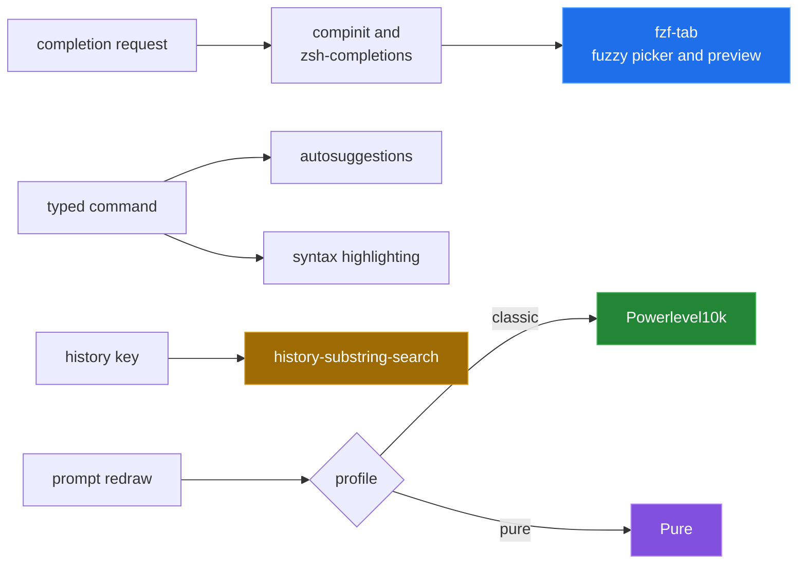

[← back to the overview](../README.md)

# Modules and customization

The profile templates are intentionally explicit: a module is sourced only when
its file or command is available. This keeps missing optional tools as warnings
or fallbacks instead of making the whole shell fail.

## Capability table

| Module or source | Provides | Aliases and functions | Widgets or key bindings |
|---|---|---|---|
| Oh My Zsh core with `git` | framework loading and Git helpers | Git aliases and helper functions from the selected plugin | shell defaults and plugin hooks |
| `zsh-completions` with `compinit` | completion definitions and cached completion state | completion functions in `fpath` | completion widgets |
| `fzf-tab` | fuzzy completion selection and previews | completion integration functions | group switching with `<` and `>` |
| `zsh-histdb` | SQLite-backed command history | history database functions and hooks | history integration from the plugin |
| `zsh-autosuggestions` | suggestions from history while typing | suggestion functions | suggestion widget hooks |
| Fast or regular syntax highlighting | command-line highlighting | highlighting functions | line-editor highlighting hooks |
| `colored-man-pages` | colored manual pages | deferred plugin functions | none specific in this template |
| `colorize` | colored file and command output when a backend exists | plugin commands and aliases | none specific in this template |
| `history-substring-search` | substring history lookup | search functions | history search key bindings |
| `autojump` and `direnv` | directory jumping and environment loading | optional plugin functions | optional hooks |
| fzf shell key bindings | fzf history and completion helpers | sourced shell functions | optional fzf widgets |
| Powerlevel10k or Pure | prompt rendering | prompt setup functions | prompt redraw hooks |

The source order matters. Completion definitions are added to `fpath` before
`compinit`; `fzf-tab` is sourced after `compinit`; the remaining plugin sources
are registered with `zsh_defer` and execute from the first `precmd` hook.

## Prompt customization

For Classic, edit the repository copy of `profiles/classic/p10k.zsh`. The
repository-specific settings at the bottom choose the left and right prompt
segments and set the command execution time threshold and colors. Source the
deployed file again or start a new shell after changing it.

For Pure, set optional variables near the top of `profiles/pure/zshrc`, such as
`PURE_PROMPT_SYMBOL` or `PURE_CMD_MAX_EXEC_TIME`. The theme itself is installed
under `$ZSH_CUSTOM/themes/pure` by the installer.

## Completion customization

The templates set completion descriptions, disable the stock menu, and use
`LS_COLORS` when it is present. For directory previews, they prefer `eza`, then
`exa`, then `ls`. Add `zstyle ':fzf-tab:*' ...` entries in the selected profile
to change picker behavior.

The completion dump path is `${XDG_CACHE_HOME:-$HOME/.cache}/zsh`, with a name
including the host and Zsh version. Remove the matching dump when testing a
fresh completion initialization.

## History and optional tools

The default database path is
`${XDG_DATA_HOME:-$HOME/.local/share}/histdb/zsh-history.db`. Set `HISTDB_FILE`
before the template sources the history plugin to use a different location.
The plugin needs `sqlite3` and its `sqlite-history.zsh` file to be readable.

`colorize` uses `pygmentize` or `chroma` according to `ZSH_COLORIZE_TOOL` and
the related style variables. `autojump`, `direnv`, and Fastfetch are detected
at startup; absence of their commands or plugin files is a supported fallback.

## Making changes persist

Edit `profiles/<profile>/zshrc` for shell behavior and
`profiles/classic/p10k.zsh` for the Classic prompt. Re-run the installer in copy
mode to deploy updated files, or use link mode when the checkout should remain
the live source. There is no separate override file in this repository.
