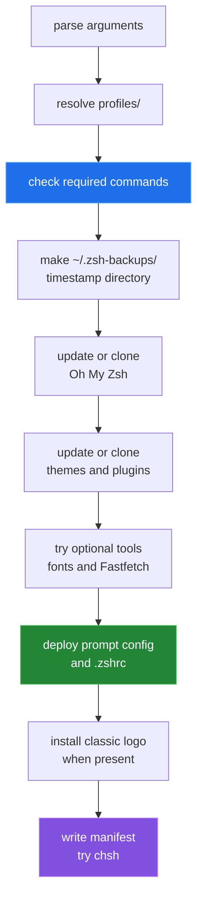

[← back to the overview](../README.md)

# Installation and updates

`install_zsh.sh` prepares the external Oh My Zsh tree, deploys one tracked
profile, and records what it did. It accepts `--copy` or `--link`, plus
`--profile <name>`.

## Preconditions

The script checks for `curl`, `git`, `zsh`, `tar`, and `find`. Network access is
needed for Oh My Zsh, themes, plugins, fonts, and the optional Fastfetch
download. The optional package path is apt-based, and `chsh` may require local
permission.



## Deployment modes

`--copy` is the default. Before replacing a destination, `deploy_file` copies
the existing file into the timestamped backup directory, removes the
destination, and copies the selected template into place.

`--link` performs the same backup, then creates a symlink from the destination
to the template in this checkout. Keep the checkout at a stable path and make
profile edits in the repository.

The deployed files are:

| Profile | `.zshrc` source | Prompt file | Fastfetch asset |
|---|---|---|---|
| classic | `profiles/classic/zshrc` | `profiles/classic/p10k.zsh` → `~/.p10k.zsh` | `fastfetch_logo.txt` |
| pure | `profiles/pure/zshrc` | no new Powerlevel10k file | none |

When Pure is selected and a `.p10k.zsh` already exists, the installer leaves it
in place. The classic profile can back up and replace the Fastfetch logo; it also
creates a default Fastfetch config only when one is absent.

## Update behavior

Existing Git checkouts are updated with `git pull --ff-only`. Missing checkouts
are shallow clones from the upstream URLs embedded in the installer. Plugin
installation is best-effort only for the optional external tools: missing
`autojump`, `direnv`, `sqlite3`, and `pygmentize` produce a warning when apt is
not available or installation fails. Missing Fastfetch follows its own release
download path and also produces a warning on failure.

## Running it

```sh
cd ~/dotfiles/zsh.dotfiles
bash install_zsh.sh --copy
bash install_zsh.sh --link
bash install_zsh.sh --profile pure --link
bash install_zsh.sh --help
```

The classic `--link` install, a re-run over it, and the Pure `--copy` install
were run in a Debian 12 container ([measurement](measurement.md)). All three
exit 0 and write `install_manifest.txt`.

## Backing out

The installer writes `install_manifest.txt` inside the backup directory with
the timestamp, script path, repository commit, deployment mode, and profile.
To back out a deployment, remove or move the current `.zshrc` and
`.p10k.zsh`, then copy the desired files from the recorded backup directory
back into place. Restore the Fastfetch logo from the same backup when it was
replaced, then start a new shell.
