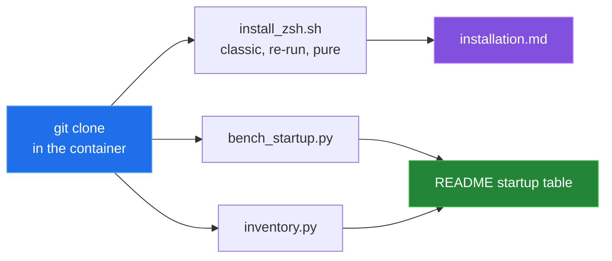

[← back to the overview](../README.md)

# How this was measured

Every number in this documentation comes from one script run in a Linux
container:

```sh
sh tools/linux-run.sh > docs/captures/linux-run.txt
```

[`tools/linux-run.sh`](../tools/linux-run.sh) starts `python:3.12-slim-bookworm`,
installs Zsh, Git and curl, and clones the read-only mounted repository. It
then runs the installer end to end in fresh home directories, the bug check,
and the two measurement tools. The installer, apt and `chsh` only change the
container. The full output is
[`captures/linux-run.txt`](captures/linux-run.txt); the JSON results are
written to `tools/results_*.json`.



## Environment

| | |
|---|---|
| Kernel | Linux 6.5.11-linuxkit, aarch64 (Docker Desktop VM) |
| Image | `python:3.12-slim-bookworm` (`sha256:392307d2…23564e`), Debian 12 |
| Tools | Zsh 5.9, GNU bash 5.2.15, Python 3.12.14 |
| User | root, so the installer's apt and `chsh` steps run without `sudo` |
| Date | 2026-09-24 |

## Syntax checks

```
bash -n install_zsh.sh exit=0
zsh -n profiles/classic/zshrc exit=0
zsh -n profiles/pure/zshrc exit=0
--help exit=0
```

## Installer runs

**Classic, `--link`, empty home:** exit 0. Oh My Zsh, both themes, the six
plugins and the four MesloLGS NF fonts are installed. `autojump`, `direnv`,
`sqlite3` and `pygmentize` come from apt. Fastfetch 2.68.1 is downloaded to
`~/.local/bin`, with a warning that the directory is not on `PATH`. `.zshrc` and
`.p10k.zsh` are symlinks into the checkout, the login shell changes to
`/usr/bin/zsh`, and the manifest records `mode=link`, `profile=classic` and the
commit. `zsh -i -c` with the deployed profile exits 0 with no stderr output.

**Re-run over the same home:** exit 0. Oh My Zsh, both themes and all six
plugins take the `git pull --ff-only` path, and `Zsh is already the default
shell.` is printed. A second timestamped backup directory is created.

**Pure, `--copy`, empty home:** exit 0. `.zshrc` is a regular file, no
`.p10k.zsh` is written, the manifest records `mode=copy` and `profile=pure`,
and the shell starts.

**Exported `ZSH`:** with `ZSH` pointing at another Oh My Zsh checkout, the
install goes to the target home and leaves the other checkout alone.

The printed hints to install `autojump`, `direnv`, `sqlite3` and Pygments
manually appear on every run, including when the tools are installed.

## Startup benchmark

```sh
python3 tools/bench_startup.py --reps 9
```

The script uses a temporary `HOME` containing shallow checkouts of the external
trees named by the installer. It writes each variant into that sandbox and
does not source any real dotfiles. It discards a warm-up round and records nine
samples per variant, interleaved in shuffled order.

The two timings are deliberately different:

- `first prompt` starts Zsh on a real PTY and stops after the first `precmd`
  marker. Deferred plugin hooks have run by that marker.
- `zsh -i -c exit` exits without reaching an interactive prompt, so it does not
  include the same deferred work.

The headline is the minimum sample, rounded to milliseconds:

| Configuration | First prompt | `zsh -i -c exit` |
|---|---:|---:|
| Bare Zsh, no `.zshrc` | 9 ms | 23 ms |
| Classic profile | 604 ms | 209 ms |
| Pure profile | 2931 ms | 225 ms |

The Docker VM was under other load during this capture, so the absolute times
are several times higher than on an idle host; compare rows within one run.

The run took place after the installer runs, so `autojump`, `direnv`, `sqlite3`
and `pygmentize` were on `PATH`; `fastfetch` and `fzf` were not. The JSON
records this under `host.optional_tools`.

The Pure first-prompt number does not break down by block. Removing any one
of the six ablated blocks brings the first prompt down to 233–396 ms, so the
"cost" column for Pure attributes about 2.5–2.7 s to every block. The committed
tools do not explain this, and the per-block Pure figures are not published as
costs. The same pattern is in the earlier macOS results. For Classic, the
largest ablation is Oh My Zsh core at +463 ms; the full list is in the capture.

## Shell inventory

```sh
python3 tools/inventory.py --profile classic --out tools/results_inventory.json
python3 tools/inventory.py --profile pure --out tools/results_inventory_pure.json
```

After the first prompt, the script dumps shell definitions and compares the
full profile with a bare Zsh baseline:

| Profile | Aliases | Functions | Widgets | Key-binding lines | Completions |
|---|---:|---:|---:|---:|---:|
| Classic | 233 | 2,118 | 106 | 33 | 1,966 |
| Pure | 233 | 1,788 | 100 | 33 | 1,966 |

These counts describe names and definition lines in the full shell delta. They
do not assign every definition to a unique plugin. The JSON also contains
per-block diffs.

## Not covered

- macOS. The installer's font path has a `darwin` branch, and its package
  steps are apt-only; only the Linux path was run.
- A non-root install, where apt and `chsh` go through `sudo`.
- The rendered prompt in a real terminal emulator, including the MesloLGS NF
  glyphs.
- Timings on other hardware. Plugin revisions are shallow-checkout facts
  recorded in the JSON; timings change with revision drift and machine load.

The Mermaid diagrams describe the source; they are not captured program output.
