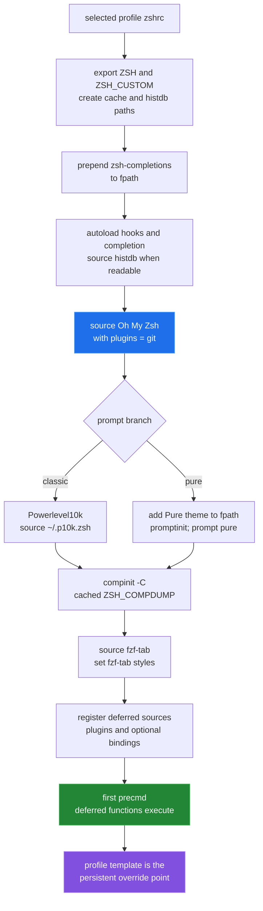

[← back to the overview](../README.md)

# Profiles and load order

Both profiles share the same shell plumbing. They differ at the prompt stage:
Classic sources Powerlevel10k configuration, while Pure adds its theme directory
to `fpath` and runs `prompt pure`.

## Classic

`profiles/classic/zshrc` sets `ZSH_THEME` to Powerlevel10k, sources the selected
`.p10k.zsh` from the home directory, and runs Fastfetch only when the shell has
a terminal and the command is available. `FASTFETCH_DISABLE` suppresses the
banner; `FASTFETCH_FLAGS` supplies extra arguments.

`profiles/classic/p10k.zsh` is a tracked copy of the prompt configuration with
repository-specific values at the end. The left prompt contains directory,
VCS, and the prompt character. The right prompt includes status, execution
time, environment and runtime context, task trackers, battery, and time
segments when their data is available.

## Pure

`profiles/pure/zshrc` adds the Pure theme directory to `fpath`, calls
`promptinit`, and selects `prompt pure`. It does not deploy a `.p10k.zsh` file.
Optional Pure variables are intended to be set near the top of that template,
such as `PURE_PROMPT_SYMBOL` and `PURE_CMD_MAX_EXEC_TIME`.

## Shared behavior

Both profiles:

- set `ZSH_COMPDUMP` below the XDG cache directory and run `compinit` once per
  shell session;
- source `zsh-histdb` when `sqlite-history.zsh` exists and set `HISTDB_FILE`;
- source `fzf-tab` immediately after completion initialization;
- defer suggestions, syntax highlighting, colorization, history search, and
  optional integrations until the first prompt;
- define `cdx`, which updates or invokes the Codex command depending on its
  first argument.

There is no separate local-override file. For persistent changes, edit the
selected profile template. Put prompt segment settings in the bottom override
block of `profiles/classic/p10k.zsh`; put shell, plugin, and environment changes
at the end of the selected `zshrc`.
