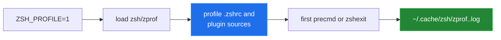

[← back to the overview](../README.md)

# Profiling Zsh startup

The templates support the Zsh `zprof` module through `ZSH_PROFILE`. The profile
is written under the Zsh cache directory as `zprof.<pid>.log` at the first
prompt and again during shell exit.



## Built-in report

```sh
ZSH_PROFILE=1 zsh -i -c 'exit'
```

Read the resulting log for self time and total time. The names most useful for
this repository are Oh My Zsh loading, `compinit`, Powerlevel10k setup, Pure
setup, and the deferred loader. A large deferred-loader entry means the first
interactive prompt is paying for plugin work that a noninteractive command may
not trigger.

## Reproducible measurements

Standard-library tools under `tools/` measure startup:

```sh
python3 tools/bench_startup.py --reps 9
python3 tools/inventory.py --profile classic --out tools/results_inventory.json
python3 tools/inventory.py --profile pure --out tools/results_inventory_pure.json
```

`bench_startup.py` creates a temporary sandbox containing shallow checkouts of
the repositories the installer would use. It measures both `zsh -i -c exit` and
time to a marker emitted from a real PTY after the first prompt hooks. It also
removes source blocks one at a time to show ablation results.

`inventory.py` reaches the first prompt, dumps aliases, functions, widgets,
bindings, completion definitions, and `fpath`, then compares the complete
profile with bare Zsh. The per-block output is diagnostic: shared Oh My Zsh
state and load order mean a diff is not a claim of unique ownership.

[`tools/linux-run.sh`](../tools/linux-run.sh) runs both in a Linux container;
see [measurement](measurement.md). Raw results are committed beside the
scripts. They include the repository
revision, host facts, sampled statistics, and shallow-checkout revisions so a
future run can explain why timings changed.
